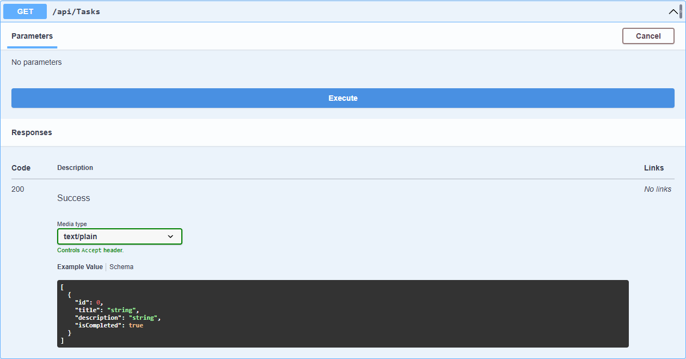
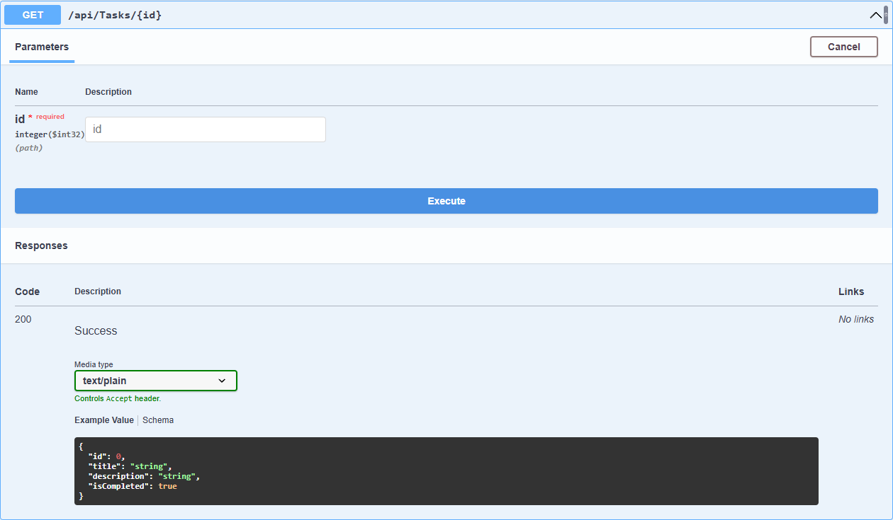
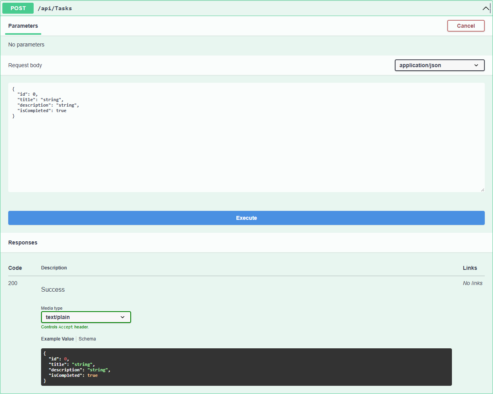
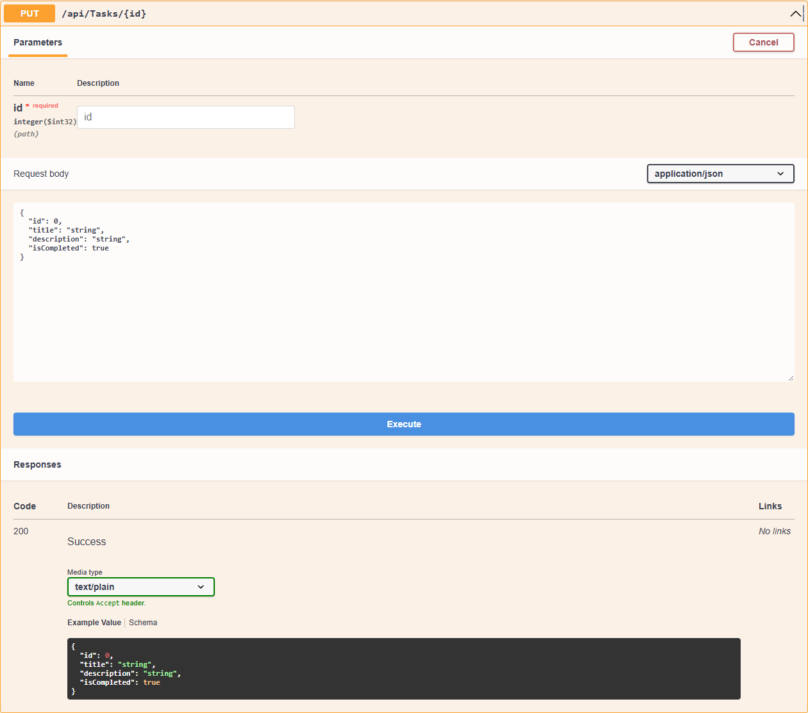
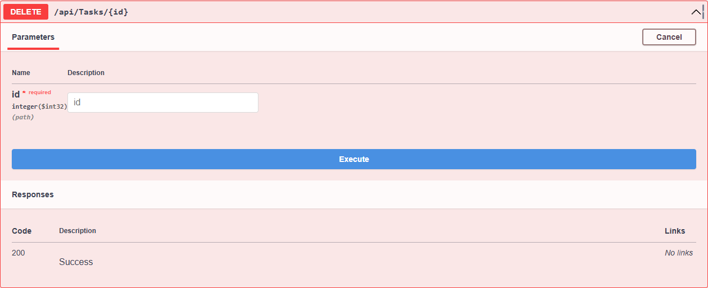

# WebApiLab2 — Модуль 02

## Краткий отчёт

Создан REST API на ASP.NET Core для управления списком задач. Использованы модель `TaskItem`, контроллер `TasksController`, маршрутизация и Swagger UI. Данные хранятся в `List<TaskItem>` в памяти приложения, база данных не используется.

## Реализованные методы

| Метод | Endpoint | Назначение | Код |
|---|---|---|---|
| GET | `/api/tasks` | Получить все задачи | `200 OK` |
| GET | `/api/tasks/{id}` | Получить задачу по Id | `200 OK`, `404 Not Found` |
| POST | `/api/tasks` | Создать задачу | `201 Created`, `400 Bad Request` |
| PUT | `/api/tasks/{id}` | Изменить задачу | `200 OK`, `400 Bad Request`, `404 Not Found` |
| DELETE | `/api/tasks/{id}` | Удалить задачу | `204 No Content`, `404 Not Found` |

## Скриншоты выполнения

### GET `/api/tasks`

### GET `/api/tasks/{id}`

### POST `/api/tasks`

### PUT `/api/tasks/{id}`

### DELETE `/api/tasks/{id}`

## Ответы на контрольные вопросы

1. Web API — интерфейс для обмена данными между приложениями по HTTP.
2. `[ApiController]` включает стандартное поведение API-контроллера и автоматическую проверку модели.
3. `[Route]` задаёт адрес, по которому доступен контроллер или его метод.
4. GET получает данные, POST создаёт новый объект.
5. PUT изменяет объект, DELETE удаляет его.
6. `200` — успешный запрос, `201` — объект создан, `400` — некорректные данные, `404` — объект не найден.
