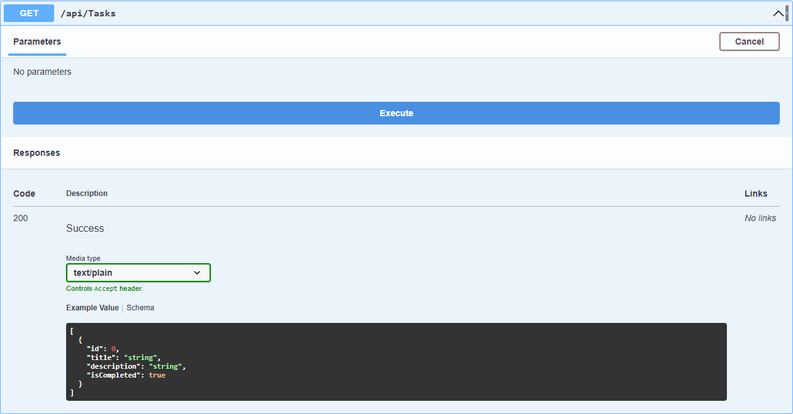
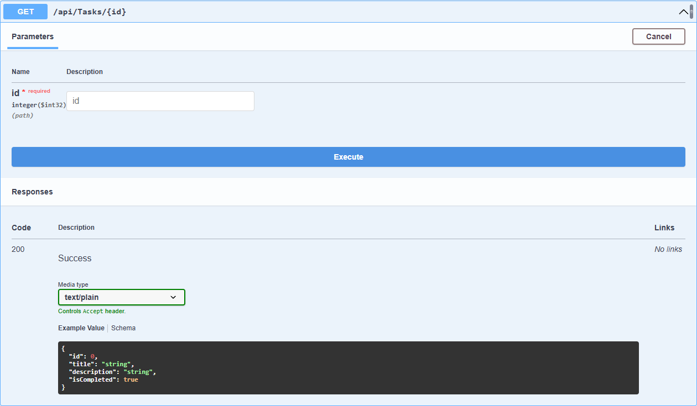
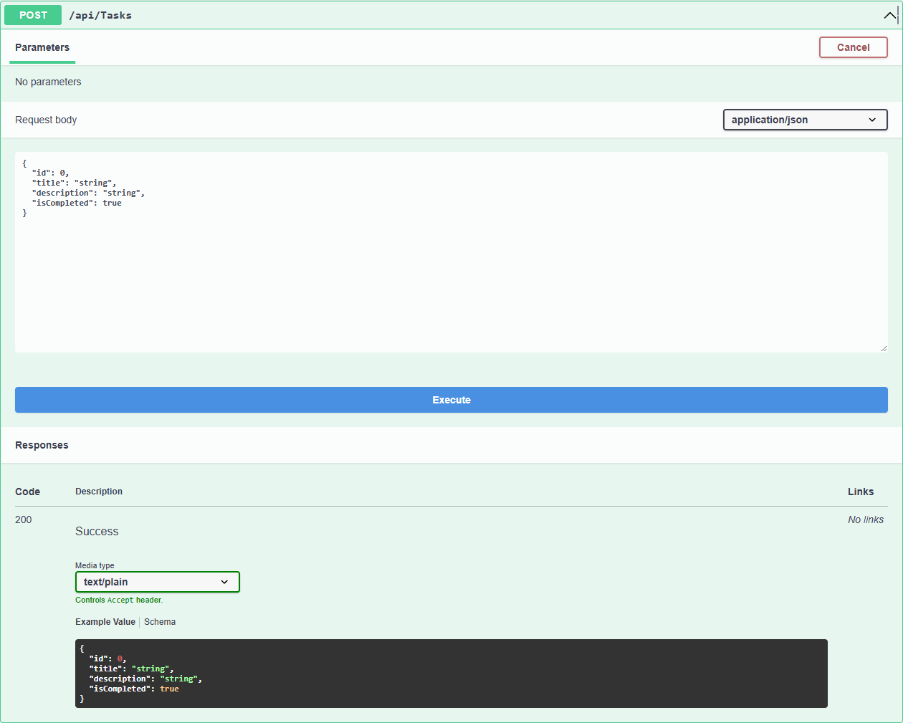
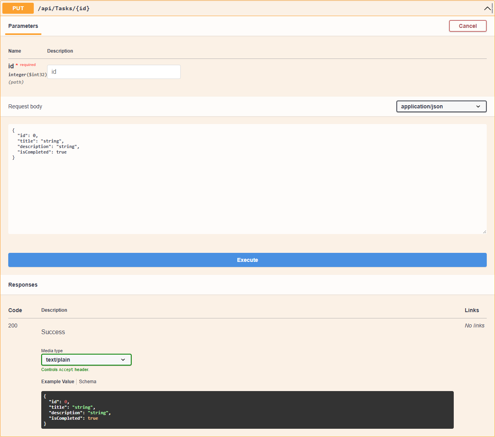
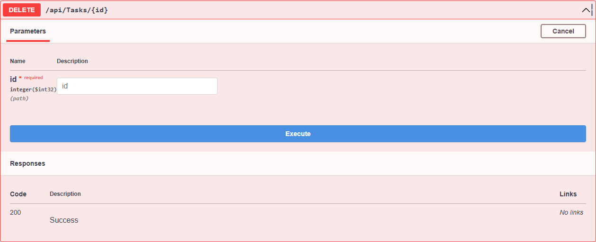

# Лабораторная работа — Модуль 02: Tasks Web API

**CSE5032 · Разработка веб-сервисов · Модуль 02**

В этой лабораторной нужно было реализовать управление задачами и проверить как успешные запросы, так и ошибки ввода. Я сделал модель с названием, описанием и статусом выполнения. Реализованы GET, POST, PUT и DELETE. Покажу создание задач, чтение, редактирование и удаление, затем проверю 400 для некорректных данных и 404 для отсутствующего ID. Хранилище находится в памяти.

---

## Цель

Закрепить создание ASP.NET Core Web API, работу с моделями и контроллерами, CRUD-запросами и кодами HTTP-ответов.

## Краткий отчёт

Создан API управления задачами. Модель `TaskItem` содержит идентификатор, заголовок, описание и статус выполнения. Контроллер предоставляет CRUD-операции и проверяет обязательный заголовок. Список хранится в памяти приложения; начальное состояние пустое.

## Выполнение по шагам

| Шаг задания | Что реализовано | Зачем |
|---|---|---|
| 1. Проект и модель | `TaskItem`: `Id`, `Title`, `Description`, `IsCompleted` | Описать поля одной задачи |
| 2. GET списка | `GET /api/tasks` возвращает коллекцию | Проверить текущее состояние списка |
| 3. GET по Id | `GET /api/tasks/{id}` возвращает задачу или `404` | Получить одну задачу |
| 4. POST | Создать задачу, назначить Id; пустой `Title` даёт `400` | Добавить валидную запись |
| 5. PUT | Обновить заголовок, описание и статус; проверяется Id и заголовок | Изменить существующую задачу |
| 6. DELETE | Удалить запись; если её нет — `404` | Удалить существующую задачу |

## Модель `TaskItem`

| Свойство | Тип | Назначение |
|---|---|---|
| `Id` | `int` | Идентификатор; назначается API |
| `Title` | `string` | Обязательное название задачи |
| `Description` | `string` | Описание |
| `IsCompleted` | `bool` | Выполнена ли задача |

## Реализованные endpoint

| Метод | Endpoint | Назначение | Фактический ответ |
|---|---|---|---|
| `GET` | `/api/tasks` | Список задач | `200 OK` |
| `GET` | `/api/tasks/{id}` | Одна задача | `200 OK` или `404 Not Found` |
| `POST` | `/api/tasks` | Создать задачу | `201 Created` или `400 Bad Request` |
| `PUT` | `/api/tasks/{id}` | Изменить задачу | `200 OK`, `400 Bad Request` или `404 Not Found` |
| `DELETE` | `/api/tasks/{id}` | Удалить задачу | `204 No Content` или `404 Not Found` |

## Пример JSON

```json
{
  "title": "Изучить HttpClient",
  "description": "Выполнить лабораторную работу",
  "isCompleted": false
}
```

## Проверка и скриншоты

Сохранены имевшиеся в репозитории отдельные изображения основных запросов. Они не удалялись и не заменялись.

Визуальная проверка показывает, что это снимки Swagger после нажатия Try it out, но до Execute: видны кнопки Execute и пример ответа, а блок фактического Server response пуст. Это реальные кадры интерфейса, но не доказательство выполненных запросов; в отчёте они оставлены с этой оговоркой.

### Шаг 1. Получить список — `GET /api/tasks`



### Шаг 2. Получить задачу по Id



### Шаг 3. Создать задачу — `POST /api/tasks`



### Шаг 4. Изменить задачу — `PUT /api/tasks/{id}`



### Шаг 5. Удалить задачу — `DELETE /api/tasks/{id}`



> В docs имеется один снимок POST; отдельных снимков трёх созданий и повторного GET после DELETE нет.

## Контрольные вопросы

1. **Что такое Web API?** — Интерфейс для обмена данными между приложениями через HTTP.
2. **Для чего нужен `[ApiController]`?** — Он включает поведение API-контроллера и помогает автоматически обнаруживать неверные входные данные.
3. **Для чего нужен `[Route]`?** — Он задаёт URL, по которому клиент вызывает контроллер или его метод.
4. **Чем GET отличается от POST?** — GET получает данные, а POST отправляет данные для создания записи.
5. **Чем PUT отличается от DELETE?** — PUT изменяет запись, DELETE удаляет её.
6. **Что означают коды 200, 201, 400 и 404?** — 200 — запрос успешен; 201 — запись создана; 400 — запрос или данные неверные; 404 — запись не найдена.

## Вывод

Реализованы все CRUD-операции и ответы для валидного, некорректного и отсутствующего ресурса. Демонстрационные данные в коде не заполнены; для соответствия условию список нужно наполнить запросами POST.
